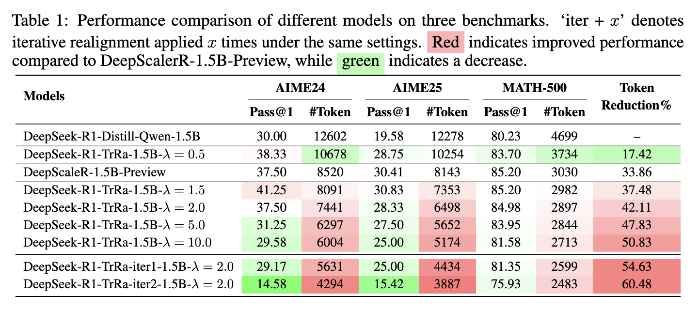
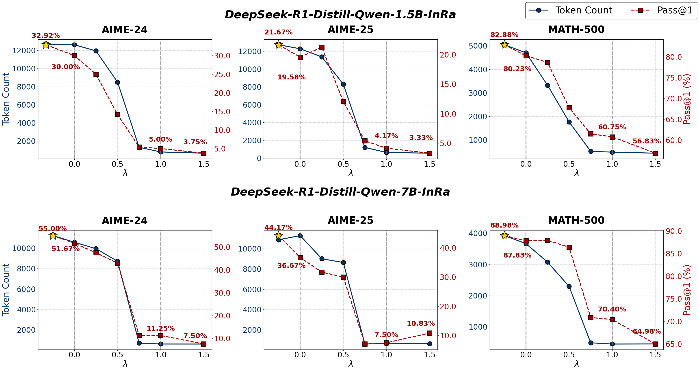

<h1 align="center">♻️ ReAligner</h1>
<p align="center">
  <a href="https://arxiv.org/pdf/2506.12704"></a>
  &nbsp;
  <a href="https://github.com/zwhong714/ReAligner"></a>
  &nbsp;
  <a href="https://huggingface.co/wh-zhu"></a>
</p>


<div>
A flexible realignment framework is proposed to quantitatively control alignment during training and inference, combining Training-time Realignment (TrRa) and Inference-time Realignment (InRa). 
</div>


<br>


# Training-time Realignment (TrRa)

- For how to realign your model, please see the [training script in this file](https://github.com/zwhong714/ReAligner/blob/main/train/TrRa.md).

- For instance, we realign DeepSeek-R1-Distill-Qwen-1.5B model by using DeepScalerR-1.5B-Preview and reduce token usage without performance loss. We provide our realigned models as follows:


| Model Name                          | Token Reduction | Performance Degrade | Download Link                                      |
|-------------------------------------|-----------------|------------------|-----------------------------|
| 🤗 DeepSeek-R1-TrRa-1.5B-λ=0.5               | 17.42    | No | <u>[Link](https://huggingface.co/wh-zhu/DeepSeek-R1-TrRa-1.5B_lambda_0.5)</u>                                 |
| 🤗 DeepSeek-R1-TrRa-1.5B-λ=1.5               | 37.48  | No    | <u>[Link](https://huggingface.co/wh-zhu/DeepSeek-R1-TrRa-1.5B_lambda_1.5)</u>                                 |
| 🤗 DeepSeek-R1-TrRa-1.5B-λ=2.0               | 42.11    | No  | <u>[Link](https://huggingface.co/wh-zhu/DeepSeek-R1-TrRa-1.5B-lambda_2)</u>                                 |
| 🤗 DeepSeek-R1-TrRa-1.5B-λ=5.0               | 47.83    | No | <u>[Link](https://huggingface.co/wh-zhu/DeepSeek-R1-TrRa-1.5B-lambda_5)</u>                                 |
| 🤗 DeepSeek-R1-TrRa-1.5B-λ=10.0               | 50.83   | No | <u>[Link](https://huggingface.co/wh-zhu/DeepSeek-R1-TrRa-1.5B-lambda_10)</u>                                 |
| 🤗 DeepSeek-R1-TrRa-iter1-1.5B-λ=2.0               | 54.63 | No    | <u>[Link](https://huggingface.co/wh-zhu/DeepSeek-R1-TrRa-iter1-1.5B-lambda_2)</u>                                 |
| 🤗 DeepSeek-R1-TrRa-iter2-1.5B-λ=2.0              | 60.48  | Yes   | <u>[Link](https://huggingface.co/wh-zhu/DeepSeek-R1-TrRa-iter2-1.5B-lambda_2)</u>  |




<br>


# Inference-time Realignment (InRa)


- For how to enable your model with thinking control ability, please see the [training script in this file](https://github.com/zwhong714/ReAligner/blob/main/train/InRa.md).

- For instance, we endow DeepSeek-R1-Distill-Qwen-1.5B with thinking control ability





We provide our hybrid models as follows:

| Model Name                          | Download Link                                      |
|-------------------------------------|----------------------------------------------------|
| 🤗 DeepSeek-R1-Distill-Qwen-1.5B-InRa                  | <u>[Link](https://huggingface.co/wh-zhu/DeepSeek-R1-Distill-Qwen-1.5B-InRa)</u>                                 |
| 🤗 DeepSeek-R1-Distill-Qwen-7B-InRa                  | <u>[Link](https://huggingface.co/wh-zhu/DeepSeek-R1-Distill-Qwen-7B-InRa)</u>                                 |


## Installation

```
conda create -n InRa python==3.10
conda activate InRa
cd vllm
VLLM_USE_PRECOMPILED=1 pip install --editable .

VLLM_USE_V1=0 vllm serve wh-zhu/DeepSeek-R1-Distill-Qwen-7B-InRa
```


## Inference

The hyperparameter `control` determines the degree of "thinking" the model performs.

- When 0 < `control` < 1, the model operates between a "thinking" and "non-thinking" mode.

- When `control` > 1, the model engages in shorter thinking.

- When `control` < 0, the model engages in longer thinking.


```python
from openai import OpenAI
openai_api_key = "EMPTY"
openai_api_base = "http://localhost:8000/v1"
client = OpenAI(
        api_key="EMPTY",
        base_url=openai_api_base,
)
chat_response = client.chat.completions.create(
    model="wh-zhu/DeepSeek-R1-Distill-Qwen-7B-InRa",
    messages=[
        {'role': 'user', 
        'content': """Find the sum of all integer bases $b>9$ for which $17_{b}$ is a divisor of $97_{b}$."""}
    ],
    extra_body={
        'stop_token_ids': [151643, 151645],
        'skip_special_tokens': False,
        'control': 0.1
    },
    temperature=0.7,
    top_p=0.95,
    max_tokens=4096*4,
    n=1
)

print(chat_response.choices[0].message.content)
```


